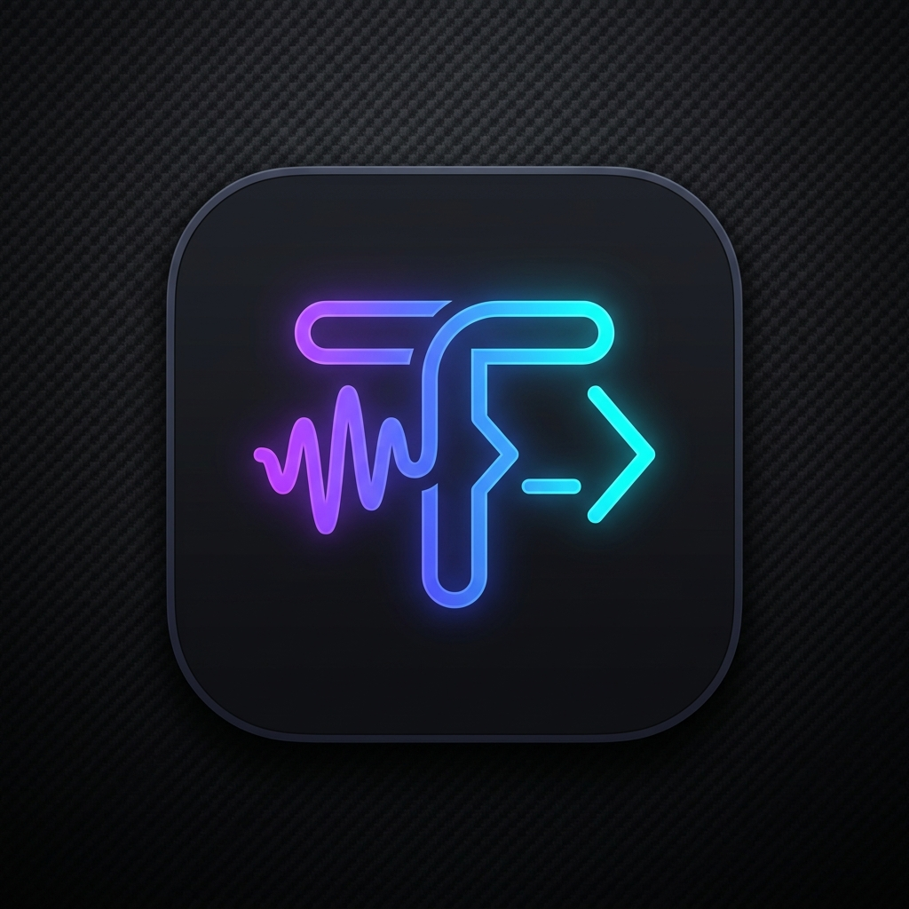
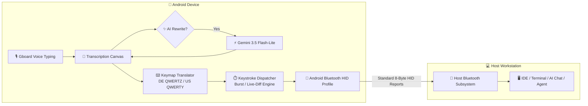

<div align="center">



# 🎙️ Type4Me

**Hardware-Level Speech-to-Keystroke & AI Prompt Bridge for Android**

[](https://android.com)
[](https://www.bluetooth.com)
[](https://deepmind.google/technologies/gemini/)
[](tests/)
[](LICENSE)

*Speak naturally. Let Gemini structure your thoughts or engineer agentic prompts. Transmit pure hardware keystrokes into any workstation with zero host-side drivers.*

</div>

---

## 🌟 Key Highlights

- ⌨️ **Pure Hardware Bluetooth HID**: Your PC, Mac, or Linux workstation detects your phone as a genuine physical Bluetooth keyboard. No background software, companion daemons, or browser extensions needed on the host.
- 🖱️ **Tactile Touchpad & Mouse Combo**: Switch instantly to trackpad mode to navigate your workstation screen. Features 1-finger smooth cursor glide, 1-finger tap (left click), long-press / 2-finger tap (right click), dedicated vertical scroll wheel strip, and adjustable speed multiplier.
- 🤖 **Agentic Prompt Engineering**: Dictate unstructured, stream-of-consciousness thoughts and instantly transform them into structured, high-agency prompts (*Context, Objective, Constraints & Rules, Required Output Format*) tailored for autonomous AI agents like **Antigravity**, **Claude**, and **Hermes**.
- ⚡ **Sub-Second Gemini 3.5 Flash-Lite**: Blazing-fast (~0.6s) intelligent speech cleanup, punctuation restoration, tone adjustment, and multilingual translation directly via Google GenAI REST API.
- ⏎ **Chat-Safe Soft-Enters**: Automatically translates multiline prompts into `Shift + Enter` keystrokes, ensuring chat windows, terminal prompts, and AI agents don't submit intermediate text prematurely before the entire message has finished typing.
- 🔴 **Live Delta-Diff Streaming**: Real-time voice typing synchronization that calculates the Longest Common Prefix (LCP) against the host text, emitting backspaces and typing additions dynamically as you speak.
- 🌐 **DIN 2137-1 German QWERTZ & US QWERTY**: Flawless hardware translation for German umlauts (`ä`, `ö`, `ü`, `ß`), `AltGr` symbols (`@`, `€`, `\`, `{`, `}`), dead keys with auto-space injection (`^`, `´`, `` ` ``), and smart typography.

---

## 🎙️ Lightweight Architecture & Voice Input Philosophy

Type4Me is intentionally designed to be **featherweight (<10 MB)** by avoiding bulky 500MB embedded ASR neural networks. Instead, it leverages the state-of-the-art voice typing already built into your Android operating system:

* **Leverage Existing On-Device Speech Engines**: Tap the transcription canvas and press the microphone icon (`🎙️`) on your on-screen keyboard.
* **Recommended Keyboard**: **Gboard (Google Keyboard)** is strongly recommended for its superior accuracy, multi-language speech recognition, seamless code-switching (e.g. English, Afrikaans, German), and offline on-device speech transcription.
* **Separation of Concerns**: Your system keyboard handles raw acoustic transcription; **Type4Me** handles **AI prompt orchestration, layout translation, and hardware keystroke injection**.

---

## 📱 Device Compatibility & Hardware Matrix

Type4Me operates via the Android **Bluetooth HID Device Profile** (`BluetoothProfile.HID_DEVICE`), allowing the phone to act as a true Bluetooth peripheral.

### 🧪 Verified Reference Device
* **Google Pixel 10 Pro** *(Android 15 / API 35)* — *100% verified with low-latency Bluetooth HID peripheral registration, mouse trackpad tracking, live LED sync, and Gemini REST rewriting.*

### 📋 Full Compatibility Matrix by Manufacturer
| OEM / Brand | Supported Models & Series | Minimum OS Version |
| :--- | :--- | :---: |
| **Google** | **Pixel 10, 10 Pro (Reference Device)**<br>Pixel 9, 9 Pro, 9 Pro XL, 9 Pro Fold<br>Pixel 8, 8 Pro, 8a<br>Pixel 7, 7 Pro, 7a<br>Pixel 6, 6 Pro, 6a<br>Pixel 5, 5a, 4, 4 XL, 4a, 3, 3 XL, 2 | Android 9.0+ |
| **Samsung** | **Galaxy S Series:** S25, S24, S23, S22, S21, S20, S10, S9<br>**Galaxy Z Series:** Z Fold (1–6), Z Flip (1–6)<br>**Galaxy Note Series:** Note 20, Note 10, Note 9<br>**Galaxy A Series:** A55, A54, A53, A52, A73, A72, A35, A34<br>**Galaxy Tab Series:** Tab S10, S9, S8, S7 | One UI 2.0+<br>(Android 10+) |
| **OnePlus** | OnePlus 13, 12, 11, 10 Pro, 9 Pro, 8 Pro, 7 Pro, 6T<br>OnePlus Nord (Nord 2, 3, 4, CE series) | OxygenOS 11+ |
| **Sony** | Xperia 1 (Mark I through VI)<br>Xperia 5 (Mark I through V)<br>Xperia 10 (Mark I through VI)<br>Xperia PRO / PRO-I | Android 10+ |
| **Motorola** | Edge series (30, 40, 50 Pro/Ultra)<br>Razr series (2022, 40 Ultra, 50 Ultra)<br>Moto G Stylus 5G, Moto G Power 5G | Android 12+ |
| **Nothing** | Phone (1), Phone (2), Phone (2a) | Nothing OS 1.5+ |
| **ASUS** | ROG Phone (3, 5, 6, 7, 8 Pro)<br>Zenfone (8, 9, 10, 11 Ultra) | Android 11+ |
| **Xiaomi / POCO** | Xiaomi 15, 14, 13, 12, 11 series<br>POCO F6, F5, F4, X6 Pro, X5 Pro<br>Redmi Note 12, 13, 14 Pro/Pro+ | HyperOS /<br>MIUI 13+ |
| **Android Go / Stripped OEM ROMs** | Budget chipsets with stripped Bluetooth HAL stacks | ❌ Unsupported |

> [!NOTE]
> **Minimum Requirement**: Android 9.0 (API 28+) with Bluetooth Low Energy (BLE) and HID Device role enabled by the device manufacturer. Android 14/15 is recommended for full `FOREGROUND_SERVICE_CONNECTED_DEVICE` background typing stability.

---

## 🏗️ Architecture



---

## 🚀 Getting Started

### 1. Requirements
* Compatible Android device with Bluetooth HID Peripheral support.
* Gboard (Google Keyboard) installed for high-speed voice dictation.
* Google Gemini API Key (get one free at [Google AI Studio](https://aistudio.google.com/)).

### 2. Pairing with your PC
1. Open **Type4Me** on your phone.
2. Tap the connection card in the top header or select **"Pair Host"** to make your device discoverable.
3. On your PC/Mac, open Bluetooth Settings, scan for **"Type4Me Keyboard"**, and pair.
4. The header on Type4Me will turn green (**Connected**) with live Caps Lock / Num Lock LED sync.

### 3. Setting your API Key
1. Tap the **Settings (⚙️)** icon in the top header.
2. Paste your Gemini API key and tap **"Test Gemini Connection"** (verifies in <1s).
3. Select your preferred model (Default: **Gemini 3.5 Flash-Lite** for ultra-low latency).

---

## 📚 Technical Documentation & Guides

Comprehensive technical guides and architecture specifications are available in the [`docs/`](docs/) directory:

* 🏛️ **[System Architecture](docs/ARCHITECTURE.md)**: Unidirectional MVI data flow, Composite Bluetooth HID descriptor (129B), LCP delta-diff streaming, and typography engine.
* 🖱️ **[Touchpad & Mouse Guide](docs/TOUCHPAD_GUIDE.md)**: Multi-touch trackpad gestures, scroll strip, tactile click buttons, and sensitivity curve tuning.
* 🤖 **[Agentic Prompt Engineering](docs/PROMPT_ENGINEERING.md)**: Transforming stream-of-consciousness speech into structured coding prompts for Antigravity, Claude, and ChatGPT.
* 📱 **[Hardware & Bluetooth HAL Matrix](docs/HARDWARE_COMPATIBILITY.md)**: Full vendor breakdown, Bluetooth HID Device profile requirements, and ADB diagnostics.

---

## 🧪 Testing & Verification

Type4Me is verified with a comprehensive multi-tier test suite:

### 1. Android JVM Unit Tests (135 Tests)
```bash
./gradlew test
```

### 2. Standalone Python E2E & Protocol Verification (301 Tests)
```bash
python tests/e2e/run_e2e_tests.py
```

* **Tier 1**: Core Feature Coverage (Report generation, Keymaps, AltGr, Dead keys)
* **Tier 2**: Boundary & Corner Cases (Empty strings, max buffers, rapid bursts)
* **Tier 3**: Cross-Feature Integration (AI rewrite + keymap translation + HID dispatch)
* **Tier 4**: Real-World Workload Scenarios (Full coding prompts, German emails)
* **Tier 5**: Adversarial Stress & Jitter (Simulated packet drops, timing jitter)

---

## 📄 License

This project is licensed under the GNU General Public License v3.0 (GPLv3) - see the [LICENSE](LICENSE) file for details.
