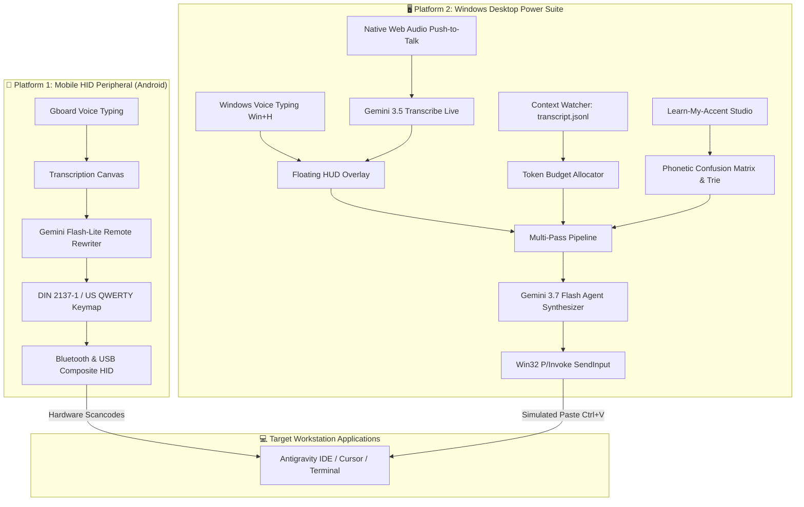

# 🏛️ Type4Me Multi-Platform System Architecture

**Type4Me** provides a unified dual-platform developer suite designed to bridge human speech, regional accent adaptation, agentic AI prompt structuring, and precise developer workstation input across two complementary paradigms:

1. **Mobile HID Hardware Peripheral (`app/`)**: An air-gapped, zero-host-software Android tool that emulates physical Bluetooth & USB keyboards/mice to type blind keystrokes into locked corporate laptops or headless terminals.
2. **Desktop Windows Power Suite (`desktop/`)**: An in-situ ambient desktop environment (Electron + React + Tailwind) featuring a Spotlight-style Floating HUD, native `Win+H` focus management, the world-first "Learn-My-Accent" phonetic calibration studio, live agent transcript context streaming (`transcript.jsonl`) with token budgeting, and Gemini 3.7 Flash prompt synthesis.

---

## 🧭 Multi-Platform System Context Diagram



---

## 🖥️ Platform 2: Windows Desktop Architecture (`desktop/`)

Type4Me Desktop is engineered as a lightweight, low-latency Windows developer utility combining an ambient Floating HUD with a multi-panel Command Center.

### 1. Dual-Mode Presentation Layer (Electron & React 19)
- **Floating HUD (`FloatingHud.tsx`)**: A frameless, semi-transparent, `WS_EX_TOPMOST` overlay summoned via global hotkey (`Ctrl+Shift+Space` or `Alt+\``). Grabs immediate caret focus so pressing `Win+H` automatically streams voice dictation into the text buffer.
- **Full Command Center (`CommandCenter.tsx`)**: High-density developer dashboard featuring five specialized modules:
  1. *Prompt Studio*: Live voice transcription, template modifier selector, and 3-way split diff preview.
  2. *Learn-My-Accent Studio*: Interactive diagnostic teleprompter with live Needleman-Wunsch alignment visualizer.
  3. *Context Inspector*: Live file monitoring for `transcript.jsonl`, active symbol chips, and token budget slider.
  4. *Template Matrix*: Prompt modifier template catalog with customizable system instructions.
  5. *Settings*: Accent profile selection, Gemini API key manager, and system hotkey bindings.

### 2. "Learn-My-Accent" Phonetic Calibration Subsystem
Resolves systematic accent distortions (e.g., Afrikaans vowel raising `/ɛ/ \rightarrow /ɪ/`, final plosive devoicing `/d/ \rightarrow /t/`, German dental fricatives `/θ/ \rightarrow /s/`) without requiring manual dictionary entry:
- **`DoubleMetaphone.ts`**: Encodes primary/alternate phonetic keys to normalize acoustic homophones.
- **`NeedlemanWunsch.ts`**: Executes dynamic programming global alignment between ground-truth calibration scripts and raw ASR transcripts to calculate Word Error Rate (WER) and classify phonetic substitutions vs insertions/deletions.
- **`ConfusionMatrix.ts`**: Automatically compiles speaker-specific pronunciation errors into a weighted substitution dictionary and updates the user's persistent profile.
- **`PhoneticTrie.ts`**: In-memory multi-word prefix tree performing sub-millisecond (<1ms) deterministic phrase replacements prior to LLM reasoning.

### 3. Context Distillation & Token Budgeting Subsystem
- **`context-watcher.js`**: Non-blocking shared file watcher (`FILE_SHARE_READ | FILE_SHARE_WRITE`) monitoring active agent logs (e.g. `transcript.jsonl`) without encountering Windows file-sharing violations.
- **`TokenBudgeter.ts`**: Extracts sliding turn windows (last 2–4 turns), active tool errors, and referenced project symbols to inject high-density context into prompt synthesis while strictly enforcing user token caps (*Lean: 500*, *Balanced: 2,000*, *Deep: 8,000* tokens).

### 4. Agentic Prompt Synthesis & Modifier Subsystem
- **`PromptModifierEngine.ts`**: Formulates structured directives across 6 developer presets (*Bug Hunter*, *Architectural Refactor*, *Gherkin Test Spec*, *Direct Surgical Diff*, *Grill-Me Trigger*, *Clean Voice*).
- **`GeminiClient.ts`**: Dispatches context-conditioned prompts to **Gemini 3.7 Flash** (`gemini-3.7-flash`), omitting deprecated sampling parameters (`temperature`, `top_p`, `top_k`) as per August 2026 specifications, with automatic graceful fallback to the local deterministic engine when offline.

### 5. Win32 Window Tracking & Simulated Injection Subsystem
- **`win32-helper.js`**: Pure Windows PowerShell P/Invoke script capturing the foreground window handle (`HWND`), title, and process prior to HUD summoning.
- **Target Pinning**: Allows locking prompt dispatch to a specific IDE window (e.g. Antigravity IDE) while referencing documentation or terminals on secondary displays.
- **Simulated Keystroke Dispatch**: Restores focus to the target `HWND` and dispatches synthesized prompts via simulated `Ctrl+V` key events.

---

## 📱 Platform 1: Mobile HID Peripheral Architecture (`app/`)

```mermaid
graph TB
    subgraph Input Layer [🎙️ Voice & Touch Input Layer]
        IME[Gboard / System IME<br/>On-Device Speech-to-Text] -->|Text Stream| Canvas[Transcription Canvas]
        Touch[Capacitive Touch Surface<br/>1-Finger / 2-Finger Gestures] -->|Motion Events| Trackpad[Touchpad Engine]
    end

    subgraph AI Intelligence Pipeline [🤖 Agentic AI Pipeline]
        Canvas -->|Raw Transcription| Rewriter[Gemini Remote Rewriter]
        Presets[(Room Database<br/>Prompt Presets)] -->|System Prompts| Rewriter
        Settings[(DataStore<br/>API Key & Model)] -->|Config| Rewriter
        Rewriter -->|Structured Prompt| Canvas
    end

    subgraph HID Translation & Protocol Layer [⌨️ Keystroke & Mouse Engine]
        Canvas -->|Buffered Text| KeymapEngine[Keymap Translator<br/>DE QWERTZ / US QWERTY]
        Canvas -->|Live Diff Text| LcpEngine[LCP Delta-Diff Engine]
        Trackpad -->|dX, dY, Buttons, Scroll| MouseEngine[Mouse Report Formatter]

        KeymapEngine --> KeystrokeDispatcher[Keystroke Dispatcher<br/>Burst / Pacing / Modifiers]
        LcpEngine --> KeystrokeDispatcher
    end

    subgraph Bluetooth HID Peripheral Transport [📡 Transport Layer]
        KeystrokeDispatcher -->|Report ID 1: 8B Keyboard| BtHid[Bluetooth HID Transport<br/>BluetoothProfile.HID_DEVICE]
        MouseEngine -->|Report ID 2: 4B Mouse| BtHid
        Service[HidDeviceService<br/>Android 14/15 FGS] --> BtHid
    end

    subgraph Host Workstation [💻 Host Workstation (Win / Mac / Linux)]
        BtHid -->|Standard HID Packets| HostBt[Host Bluetooth Stack]
        HostBt --> HostOs[OS Kernel HID Driver<br/>Zero Client Software]
        HostOs --> WorkstationApps[IDE / Terminal / Claude / Antigravity / Cursor]
    end
```

---

## 🧩 Architectural Components

### 1. Presentation Layer (Jetpack Compose & MVI)
- **Unidirectional Data Flow**: The UI is entirely driven by `MainViewModel` observing a single immutable `MainUiState` flow and processing structured `MainUiIntent` actions.
- **Adaptive Layout**: Features `verticalScroll` handling and responsive layout scaling across Portrait and Landscape orientations, with soft-keyboard inset awareness.
- **Component Decomposition**:
  - `ConnectionHeader`: Displays real-time Bluetooth connection status, connected host name, and LED indicators (Caps Lock, Num Lock).
  - `ControlBar`: Instant layout toggling (DE QWERTZ vs. US QWERTY), live-diff toggle, and typing speed slider (2ms–50ms).
  - `PresetSelector`: Horizontal scrolling chip bar for built-in and custom AI prompt templates.
  - `TranscriptionCanvas`: Live speech transcription and text editing canvas with word/character telemetry.
  - `TouchpadCanvas`: Full-screen trackpad with multi-touch gestures, scroll strip, and physical click buttons.

---

### 2. Composite Bluetooth HID Engine
The application emulates a **Composite Bluetooth Human Interface Device (HID)** conforming to the USB HID 1.11 specification.

#### HID Report Descriptor Layout (129 Bytes)
```
+------------------------------------------------------------------------+
|                      COMPOSITE HID REPORT DESCRIPTOR                   |
+------------------------------------+-----------------------------------+
|  KEYBOARD REPORT (Report ID 1)     |  MOUSE REPORT (Report ID 2)       |
|  - Usage: Generic Desktop Keyboard |  - Usage: Generic Desktop Mouse   |
|  - Input Report: 8 Bytes           |  - Input Report: 4 Bytes          |
|    * Byte 0: Modifier Bitmask      |    * Byte 0: Button Bitmask (L/R/M|
|    * Byte 1: Reserved OEM Byte     |    * Byte 1: Relative dX (-127..+127)
|    * Bytes 2-7: 6-Key Rollover     |    * Byte 2: Relative dY (-127..+127)
|  - Output Report: 1 Byte (LEDs)    |    * Byte 3: Relative Wheel       |
+------------------------------------+-----------------------------------+
```

#### Bluetooth SDP Record Configuration
- **Device Name**: `Type4Me Keyboard`
- **Device Provider**: `Type4Me`
- **Device Description**: `Voice-to-HID Speech Input & Touchpad Companion`
- **SDP Subclass**: `0xC0` (`0x40` Keyboard | `0x80` Mouse = Combo Peripheral)

---

### 3. Keymap Translation & Typography Subsystem
Translates UTF-8 strings into hardware HID scancodes and modifier bitmasks (`MOD_LSHIFT`, `MOD_RALT` / `AltGr`).

- **German QWERTZ (DIN 2137-1)**:
  - Umlauts (`ä`, `ö`, `ü`, `ß`) mapped to dedicated German key scancodes (`0x34`, `0x33`, `0x2F`, `0x2D`).
  - Swapped `Z` (`0x1D`) and `Y` (`0x1C`).
  - `AltGr` symbols: `@`, `€`, `\`, `{`, `}`, `[`, `]`, `~`, `|` mapped with `MOD_RALT`.
  - **Dead Keys**: Acute (`´`), Grave (`` ` ``), and Circumflex (`^`) automatically inject a trailing Space keystroke (`0x2C`) to prevent accidental host dead-key combinations.
- **US QWERTY**:
  - Full ASCII symbol map (shifted numbers, punctuation, curly brackets).
  - Shifted symbols correctly synthesized with `MOD_LSHIFT`.
- **Chat-Safe Soft-Enters**:
  - `\n` and `\r` newline characters are translated into `Shift + Enter` (`MOD_LSHIFT | KEY_ENTER`). This ensures multiline prompts can be streamed into AI chat interfaces (ChatGPT, Claude, Antigravity, Discord) without triggering premature message submissions.

---

### 4. Live Delta-Diff Synchronization (LCP Engine)
When **Live Diff Mode** is active:
1. Every partial hypothesis from voice typing is compared against the previously transmitted text.
2. The engine computes the **Longest Common Prefix (LCP)** between previous and new text.
3. It emits `N = len(previous) - LCP` `KEY_BACKSPACE` keystrokes to erase divergent suffixes.
4. It types the new suffix characters dynamically.
5. In-flight coroutine jobs are conflated and serialized to guarantee deterministic ordering during rapid speech.

---

### 5. Dynamic AI Rewrite Pipeline
- **Google GenAI REST Integration**: Built with direct REST payload architecture to bypass gRPC/SDK threading bottlenecks.
- **Sub-Second Execution**: Uses `gemini-3.5-flash-lite` by default for ultra-low latency (~0.6s).
- **Dynamic Key & Model Resolution**: Reads API keys and model selections dynamically on every rewrite request without requiring app restarts or service recreation.
- **Room Database Presets**: Built-in presets are seeded automatically and can be extended by user-defined custom prompts stored locally.

---

### 6. Dual Hardware Transport: Wireless Bluetooth & Wired USB
Type4Me supports two decoupled transport pipelines via the [`HidTransport`](../app/src/main/java/com/transcriptor/hid/service/HidTransport.kt) interface:

1. **Bluetooth HID Peripheral (`BluetoothHidTransport.kt`)**:
   - Manages the Android `BluetoothHidDevice` lifecycle, SDP registration, and host state synchronization.
2. **Wired USB Transport (`UsbHidTransport.kt`)**:
   - **Android Open Accessory (AOA) 2.0**: Direct USB cable connection emulating an in-box USB keyboard & mouse.
   - **ADB Reverse Socket Bridge**: Relays HID reports over local TCP (`adb reverse tcp:8080 tcp:8080`) during development or tethered sessions.
   - **Linux USB Gadget (`/dev/hidg0`)**: Direct kernel character device integration via ConfigFS for rooted/embedded environments.
   - *Target Environments*: RF-shielded laboratories, government/defense workstations where Bluetooth is disabled by policy, or desktop rigs lacking a Bluetooth adapter.

---

## 🔒 Security & Screen Privacy Model

```
+-------------------------------------------------------------+
|                  HOST WORKSTATION BOUNDARY                  |
|                                                             |
|   [Confidential Source Code / Proprietary CAD / Financials]  |
|                               ^                             |
|                               | (100% INVISIBLE TO APP)     |
|   +---------------------------+-------------------------+   |
|   |         OS Kernel Physical Input Subsystem          |   |
|   +---------------------------^-------------------------+   |
+-------------------------------|-----------------------------+
                                | Standard Blind Keystrokes
                                | (No Telemetry / No Screen Scraping)
+-------------------------------|-----------------------------+
|   [Type4Me Mobile App]        |                             |
|   (Speech-to-Text & Gemini) --+                             |
|                                                             |
|                    ANDROID PHONE BOUNDARY                   |
+-------------------------------------------------------------+
```

### 1. Zero Screen & Host File Exposure
Traditional AI writing assistants, desktop screen-recorders, or OCR overlays require OS accessibility permissions to scrape what is currently open on your monitor. 

**Type4Me offers absolute privacy**:
- The application executes **exclusively on your personal phone**.
- It has **zero access** to host display buffers, open windows, clipboard history, or workstation filesystems.
- The host workstation perceives Type4Me as an unthinking, hardware keyboard and mouse plugged into a physical port.

### 2. Universal Application Compatibility
Because Type4Me injects standard hardware scancodes at the OS kernel driver layer, it requires **zero plugins, extensions, or host background software**. 

It instantly enables voice typing and agentic prompt restructuring in:
- **Locked-Down Virtual Desktops**: Citrix Workspace, VMware Horizon, Microsoft Remote Desktop (RDP).
- **Terminal Consoles & Remote Shells**: SSH, PuTTY, `tmux`, `screen`, `vim`, `nano`, `emacs`.
- **Engineering & IDE Workspaces**: VS Code, Android Studio, CLion, Cursor, MATLAB, Simulink, Unreal Engine, Blender.
- **Air-Gapped Workstations & UEFI**: Secure development networks, server consoles, and even BIOS/UEFI configuration screens.
