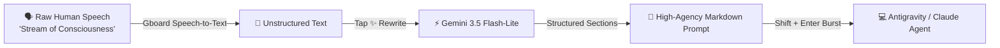

# 🤖 Agentic Prompt Engineering Guide

**Type4Me** is engineered specifically for developers, researchers, and power users who work with autonomous AI agents (such as **Google Antigravity**, **Claude Code**, **ChatGPT Canvas**, and **Cursor**).

Instead of tediously typing complex, structured instructions by hand, Type4Me allows you to dictate messy, stream-of-consciousness thoughts and instantly translates them into **high-agency, production-ready system prompts**.

---

## ⚡ The Voice-to-Agent Workflow

### Why Chat-Safe Soft-Enters Matter
In AI chat boxes, web terminals, and CLI agents, pressing single `Enter` triggers an immediate form submission. If an app tries to paste or type a multiline prompt containing standard `Enter` keypresses, the agent executes the first line prematurely with an incomplete task.

**Type4Me solves this at the hardware keymap layer**:
* All newline characters (`\n` and `\r`) are automatically intercepted and translated into hardware `Shift + Enter` keystrokes.
* The entire multiline markdown prompt is typed cleanly into the chat box or terminal without triggering execution until you choose to submit.

---

## 📦 Built-In Prompt Presets

Type4Me ships with carefully crafted prompt templates stored in the local Room database:

### 1. 🤖 Agent Prompt (Default Recommended)
Transforms raw dictation into a structured engineering specification tailored for AI coding agents.
* **Format**:
  * **Objective**: Clear 1-sentence goal.
  * **Context & Domain**: Background rationale and architecture constraints.
  * **Requirements / Steps**: Numbered, unambiguous implementation checklist.
  * **Constraints & Guardrails**: Edge cases, performance limits, and rules.
  * **Expected Output**: Specific deliverables (code diffs, test passes, logs).

### 2. ✨ Clean Speech
Removes verbal filler words ("um", "uh", "like", "you know", "basically"), repairs grammatical slips, restores punctuation, and formats bullet lists while strictly preserving the speaker's original intent.

### 3. 💼 German Professional Email (Geschäftlich)
Translates and formats spoken notes into formal German business correspondence (*Sie-Form*), complete with proper greeting, clear subject line, concise body paragraphs, and professional sign-off (*Mit freundlichen Grüßen*).

### 4. 📝 Markdown Summary
Condenses unstructured ramblings into a dense, highly scannable Markdown summary with bold key terms, tables, and action items.

### 5. 🎯 Executive Brief
Distills complex discussions into a 3-bullet executive brief focusing on **Bottom Line**, **Key Risk / Blocker**, and **Next Immediate Action**.

---

## 🛠️ Creating Custom Presets

You can create unlimited custom presets directly inside the app:

1. Tap the **`+` (Add Preset)** button on the chips bar.
2. Enter a **Preset Title** (e.g. `Simscape Review`, `Git Commit Message`, `Python Docstring`).
3. Write the **System Prompt Instructions**.
4. Tap **Save**. Your preset is stored securely in SQLite via Android Room and available instantly on the main chips bar.

---

## 🎙️ Speaker Accent & Phonetic Adaptation (Contextual ASR Repair)

Automated Speech Recognition (ASR) engines often misinterpret non-native accents, specialized engineering terminology, or fast multilingual speech. 

For example:
* An **Afrikaans** speaker dictating English might have *"think"* transcribed as *"sink"*, *"deadlock"* as *"datelock"*, or *"variable"* as *"weriable"*.
* A **German** speaker might have *"would"* transcribed as *"vould"*, *"work"* as *"vork"*, or *"actual"* as *"current"* (*aktuell*).

### How Type4Me Adapts:
In **Settings (⚙️)**, select your **Native Accent** (e.g. 🇿🇦 *Afrikaans / South African*, 🇩🇪 *German*, 🇳🇱 *Dutch*, 🇫🇷 *French*, 🇮🇳 *Indian*, or a *Custom Accent*) and one or more **Spoken Languages** (e.g. 🇬🇧 *English* + 🇿🇦 *Afrikaans* + 🇩🇪 *German*).

### 🔄 Multilingual Code-Switching Mode:
When 2 or more languages are selected (e.g. *English + Afrikaans*), Type4Me activates **Code-Switching Adaptation**:
> *"NOTE ON MULTILINGUAL CODE-SWITCHING & PHONETICS: The input text was transcribed via automated speech recognition from a multilingual speaker code-switching and alternating between English and Afrikaans with an Afrikaans accent. Intelligently recognize valid vocabulary, idioms, and technical terms across all these languages, reconstruct phonetic ASR mis-transcriptions and vowel shifts based on context, and fulfill the requested preset formatting."*

This allows bilingual speakers to speak naturally without ASR stumbling over loanwords, technical jargon, or colloquial shifts between languages.

---

## ⚡ Recommended Model: Gemini 3.5 Flash-Lite

Under **Settings (⚙️)**, Type4Me supports the following models:

| Model | Average Latency | Best Used For |
| :--- | :---: | :--- |
| **`gemini-3.5-flash-lite` (Default)** | **~0.6s** | **Ultra-low latency dictation cleanup, live prompt generation, and instant rewriting.** |
| **`gemini-3-flash-preview`** | ~2.1s | High-reasoning prompt restructuring and complex multi-step instructions. |
| **`gemini-3.7-flash`** | 10s–30s | Deep chain-of-thought analysis (slower response time). |
